# CSCE 435 Group project

## 0. Group number: 18

## 1. Group members:
1. Trey Wells
2. Aaron Weast
3. Jacob Miller
4. David Vilenchouk

## 2. Project topic (e.g., parallel sorting algorithms)

 Sorting Algorithm Performance Comparisons for MPI and CUDA

### 2a. Brief project description (what algorithms will you be comparing and on what architectures)

For the duration of this project, our team plans on communicating via Slack. 

For our algorithms, we plan on implementing various sorting algorithms. The four sorting algorithms we are planning on implementing are Bubble sort, Merge Sort, quick sort, and insertion sort. 

For each of the algorithms, we are planning on implementating in both MPI and CUDA so that we can compare the differences in CPU vs. GPU parallelization. Not only will we be comparing the differences in CPU and GPU speed but we will also be testing the differences in the algorithms on various types of inputs. For example, we might run each algorithm on a completely random input, then on a partially sorted one, then on a completely sorted one. 

- Quicksort (MPI):
	We have implemented the quicksort algorithm that uses MPI to communicate and function in parallel. It uses a recursive tree method in order to disperse segments to multiple proccsess to sort. It will combine the arrays after sorted.

- Quicksort (CUDA):
	We have implemented the quicksort algorithm using CUDA on the GPU to communicate and function in parallel. It uses an iterative approach to call the kernal which will create partitions of the data for multiple proccess to use until there are not anymore proccesses. It combines the sorted data afterwards.

- BubbleSort (MPI):
	We have implemented the buble sort algorithm using MPI to communiate and function parallel. It is implemented using an even-odd transposition where each processor is responsible for a range of values in the data and then after sorting its personal data, it will communicate and trade data with the processors that are "next" to it. After going through all the phases, it gathers all the data into the root rank. 

- BubbleSort (CUDA):
	We have implemented the bubble sort algorithm using CUDA on the GPU to communicate and function in parallel. This algorithm functions similar to an actual bubble sort where each thread is given a range of values in the data to perform a bubble sort on. Then we call the sorting function again with one less block so that each thread is sorting more and more values till we reach the very end. 

- Mergesort (MPI):
  	We have implemented the mergesort algorithm that uses MPI to communicate in parallel. It uses recursive calls on consecutively smaller halves of an array before gathering the data from the processes to recombine it.
  	Given the Grace outage, I have been unable to test whether this code currently works or not. However, you can clearly see in the Git commit history that I have been trying despite this so that I can test it as soon as Grace is back up.

- Mergesort (CUDA):
  	We have implemented the mergesort algorithm that uses CUDA to function on the GPU. It will partition the array data to multiple processes by splitting the array in half iteratively before recombining the sorted portions.
  	Given the Grace outage, I have been unable to test whether this code currently works or not. However, you can clearly see in the Git commit history that I have been trying despite this so that I can test it as soon as Grace is back up.

- Insertionsort (MPI):
  	We have implemented the insertionsort algorithm that uses MPI to communicate in parallel. It will transfer elements in the array one at a time to the right position.
  	Given the Grace outage, I have been unable to test whether this code currently works or not. However, you can clearly see in the Git commit history that I have been trying despite this so that I can test it as soon as Grace is back up.

- Insertionsort (CUDA):
  	We have implemented the insertionsort algorithm that uses CUDA to function on the GPU. It will transfer elements in the array one at a time to the right position.
  	Given the Grace outage, I have been unable to test whether this code currently works or not. However, you can clearly see in the Git commit history that I have been trying despite this so that I can test it as soon as Grace is back up.

### 2b. Pseudocode for each parallel algorithm

For example:

**- Bubble Sort (MPI)**
	```

	int findPartner(int phase, int rank) {
		int partner;

		/* if it's an even phase */
		if (phase % 2 == 0) {
			/* if we are an even process */
			if (rank % 2 == 0) {
				partner = rank + 1;
			} else {
				partner = rank - 1;
			}
		} else {
			/* it's an odd phase - do the opposite */
			if (rank % 2 == 0) {
				partner = rank - 1;
			} else {
				partner = rank + 1;
			}
		}
		return partner;
	}

	void parallel_sort(int *data, int rank, int count_processes, unsigned long data_size)
	{

		CALI_MARK_BEGIN(comp);
		CALI_MARK_BEGIN(comp_large);

		const unsigned long concat_data_size = data_size * 2;

		auto *other      = new int[data_size];
		auto *concatData = new int[concat_data_size];

		for (int i=0; i<count_processes; i++)
		{
			int partner = findPartner(i, rank);
			if (partner < 0 || partner >= count_processes)
			continue;

			CALI_MARK_END(comp_large);
			CALI_MARK_END(comp);

			CALI_MARK_BEGIN(comm);
			CALI_MARK_BEGIN(comm_large);

			if (rank % 2 == 0) {
				CALI_MARK_BEGIN(MPI_Send);
				MPI_Send(data, (int) data_size, MPI_INT, partner, 0, MPI_COMM_WORLD);
				CALI_MARK_END(MPI_Send);

				CALI_MARK_BEGIN(MPI_Recv);
				MPI_Recv(other, (int) data_size, MPI_INT, partner, 0, MPI_COMM_WORLD, MPI_STATUS_IGNORE);
				CALI_MARK_END(MPI_Recv);
			} else {
				CALI_MARK_BEGIN(MPI_Recv);
				MPI_Recv(other, (int) data_size, MPI_INT, partner, 0, MPI_COMM_WORLD, MPI_STATUS_IGNORE);
				CALI_MARK_END(MPI_Recv);

				CALI_MARK_BEGIN(MPI_Send);
				MPI_Send(data, (int) data_size, MPI_INT, partner, 0, MPI_COMM_WORLD);
				CALI_MARK_END(MPI_Send);
			}

			CALI_MARK_END(comm_large);
			CALI_MARK_END(comm);

			CALI_MARK_BEGIN(comp);
			CALI_MARK_BEGIN(comp_large);

			merge(data,  data  + data_size,
				other, other + data_size,
				concatData);
			qsort(concatData, concat_data_size, sizeof(int), compare);

			auto posHalfConcatData = concatData + data_size;
			if (rank < partner)
				copy(concatData, posHalfConcatData, data);
			else
				copy(posHalfConcatData, concatData + concat_data_size, data);
		}

		CALI_MARK_END(comp);
		CALI_MARK_END(comp_large);

	}

	int main(int argc, char** argv)
	{
		MPI_Init(&argc, &argv);

		CALI_MARK_BEGIN(main_function);

		CALI_MARK_BEGIN(data_init);
		int status = fill_vector_with_numbers(data, rank, count_processes, localSize);
		CALI_MARK_END(data_init);

		parallel_sort(data, rank, count_processes, localSize);

		CALI_MARK_BEGIN(comm);
		CALI_MARK_BEGIN(comm_large);
		CALI_MARK_BEGIN(MPI_Gather);

		// Gather data from all processes onto rank 0
		MPI_Gather(data, localSize, MPI_INT, gathered_data, localSize, MPI_INT, 0, MPI_COMM_WORLD);

		CALI_MARK_END(MPI_Gather);
		CALI_MARK_END(comm_large);
		CALI_MARK_END(comm);
		
		// Print the sorted data on rank 0
		if (rank == 0) {
			CALI_MARK_BEGIN(correctness_check);
			if gathered_data is sorted:
				display message to output

			CALI_MARK_END(correctness_check);
		}

		CALI_MARK_END(main_function);

		MPI_Finalize();
	}

	```
    Source: https://github.com/erenalbayrak/Odd-Even-Sort-mit-MPI/blob/master/implementation/c%2B%2B/OddEvenSort.cpp

**- Bubble Sort (CUDA)**
	```

	__global__ void bubbleSortDeviceParallel(int *array, int offSet, int THREADS, int BLOCKS)
	{

		int index = blockIdx.x * blockDim.x + threadIdx.x;
		int indexPerBlock = threadIdx.x;
		int temp;

		if (index  < THREADS* BLOCKS) {

			// FIRST STEP
			if (offSet == 0) {

				// DO THREAD SORTING IN CORRESPONDING BLOCK 
				for (int j = 0; j < THREADS / 2; j++) {

					for (int i = 0; i < THREADS * 2 - 1 - indexPerBlock * 2; i++) {

						if (array[index * 2 + i] > array[index * 2 + 1 + i]) {
							temp = array[index * 2 + 1 + i];
							array[index * 2 + 1 + i] = array[index * 2 + i];
							array[index * 2 + i] = temp;
						}
					}
					__syncthreads();
				}
			}
			// ALL OTHER STEPS, INDEX/THREADS/BLOCKS SHIFTED FOR int offSet
			// LAST BLOCK SKIPPED
			else {
				if (blockIdx.x != BLOCKS - 1) {
					for (int j = 0; j < THREADS / 2; j++) {
						for (int i = offSet; i < THREADS * 2 - 1 + offSet - indexPerBlock * 2; i++) {

							if (array[index * 2 + i] > array[index * 2 + 1 + i]) {
								temp = array[index * 2 + 1 + i];
								array[index * 2 + 1 + i] = array[index * 2 + i];
								array[index * 2 + i] = temp;
							}

						}
						__syncthreads();
					}
				}
			}
		}

	}

	int main(int argc, char* argv[])
	{
		CALI_MARK_BEGIN(main_function);

		srand(time(NULL));
		THREADS = atoi(argv[1]);
		NUM_VALS = atoi(argv[2]);
		size_t size = NUM_VALS * sizeof(int);
		BLOCKS = NUM_VALS / THREADS;
		int *h_array;
		int *d_array;
		int offSet;

		h_array = new int[NUM_VALS];

		if (cudaMalloc(&d_array, size) != cudaSuccess)
		{
			cout << "D_ARRAY ALLOCATING NOT WORKING!" << endl;
			return 0;
		}

		CALI_MARK_BEGIN(data_init);

		// Generate the data in parallel
		// Generate in reverse sorted order
		Generate data in parallel;

		cudaDeviceSynchronize();

		CALI_MARK_END(data_init);

		CALI_MARK_BEGIN(comp);
		CALI_MARK_BEGIN(comp_large);


		do {

			for (int i = 0; i < THREADS * 2; i++) {
				offSet = i;
				// POSSIBLE CHANGE: if offset != 0 USE bubbleSortDeviceParallel << < BLOCKS-1, THREADS >> > (d_array, offSet);
				bubbleSortDeviceParallel << < BLOCKS, THREADS >> > (d_array, offSet, THREADS, BLOCKS);
			}

			BLOCKS--;
		} while (BLOCKS > 0);

		cudaDeviceSynchronize();

		CALI_MARK_END(comp_large);
		CALI_MARK_END(comp);

		CALI_MARK_BEGIN(comm);
		CALI_MARK_BEGIN(comm_large);
		CALI_MARK_BEGIN(memcpyDeviceToHost);

		cudaMemcpy(h_array, d_array, size, cudaMemcpyDeviceToHost);

		CALI_MARK_END(memcpyDeviceToHost);
		CALI_MARK_END(comm_large);
		CALI_MARK_END(comm);

		CALI_MARK_BEGIN(correctness_check);

		if h_array is sorted:
			display message to output

		CALI_MARK_END(correctness_check);

		CALI_MARK_END(main_function);

	}
 	```

    Source: https://github.com/domkris/CUDA-Bubble-Sort/blob/master/CUDABubbleSort/kernel.cu

**- Quick Sort (MPI)**
```  
	#include "mpi.h"
	#include <stdio.h>
	#include <stdlib.h>
	#include <math.h>
	#include <stdbool.h>
	
	#include <caliper/cali.h>
	#include <caliper/cali-manager.h>
	#include <adiak.hpp>
	
	using namespace std;
	
	#define SIZE 1000000
	
	/*
	    Divides the array given into two partitions
	    - Lower than pivot
	    - Higher than pivot
	    and returns the Pivot index in the array
	*/
	int partition(int *arr, int low, int high) {
	    int pivot = arr[high];
	    int i = (low - 1);
	    int j, temp;
	    for (j = low; j <= high - 1; j++) {
	        if (arr[j] < pivot) {
	            i++;
	            temp = arr[i];
	            arr[i] = arr[j];
	            arr[j] = temp;
	        }
	    }
	    temp = arr[i + 1];
	    arr[i + 1] = arr[high];
	    arr[high] = temp;
	    return (i + 1);
	}
	
	/*
	    Hoare Partition - Starting pivot is the middle point
	    Divides the array given into two partitions
	    - Lower than pivot
	    - Higher than pivot
	    and returns the Pivot index in the array
	*/
	int hoare_partition(int *arr, int low, int high) {
	    int middle = floor((low + high) / 2);
	    int pivot = arr[middle];
	    int j, temp;
	    // move pivot to the end
	    temp = arr[middle];
	    arr[middle] = arr[high];
	    arr[high] = temp;
	
	    int i = (low - 1);
	    for (j = low; j <= high - 1; j++) {
	        if (arr[j] < pivot) {
	            i++;
	            temp = arr[i];
	            arr[i] = arr[j];
	            arr[j] = temp;
	        }
	    }
	    // move pivot back
	    temp = arr[i + 1];
	    arr[i + 1] = arr[high];
	    arr[high] = temp;
	
	    return (i + 1);
	}
	
	/*
	    Simple sequential Quicksort Algorithm
	*/
	void quicksort(int *number, int first, int last) {
	    if (first < last) {
	        int pivot_index = partition(number, first, last);
	        quicksort(number, first, pivot_index - 1);
	        quicksort(number, pivot_index + 1, last);
	    }
	}
	
	/*
	    Functions that handle the sharing of subarrays to the right clusters
	*/
	int quicksort_recursive(int *arr, int arrSize, int currProcRank, int maxRank, int rankIndex) {
	    MPI_Status status;
	
	    // Calculate the rank of the Cluster to which I'll send the other half
	    int shareProc = currProcRank + pow(2, rankIndex);
	    // Move to a lower layer in the tree
	    rankIndex++;
	
	    // If no Cluster is available, sort sequentially by yourself and return
	    if (shareProc > maxRank) {
	        MPI_Barrier(MPI_COMM_WORLD);
	        CALI_MARK_BEGIN("quicksort");
	        quicksort(arr, 0, arrSize - 1);
	        CALI_MARK_END("quicksort");
	        return 0;
	    }
	    // Divide the array into two parts with the pivot in between
	    int j = 0;
	    int pivotIndex;
	
	    
	    
	    // CALI_MARK_BEGIN("comp_small");
	    CALI_MARK_BEGIN("partition");
	    pivotIndex = hoare_partition(arr, j, arrSize - 1);
	    CALI_MARK_END("partition");
	    // CALI_MARK_END("comp_small");
	    
	    
	
	
	    // Send a partition based on size (always send the smaller part),
	    // Sort the remaining partitions,
	    // Receive the sorted partition
	    if (pivotIndex <= arrSize - pivotIndex) {
	        MPI_Send(arr, pivotIndex, MPI_INT, shareProc, pivotIndex, MPI_COMM_WORLD);
	        quicksort_recursive((arr + pivotIndex + 1), (arrSize - pivotIndex - 1), currProcRank, maxRank, rankIndex);
	        MPI_Recv(arr, pivotIndex, MPI_INT, shareProc, MPI_ANY_TAG, MPI_COMM_WORLD, &status);
	    } else {
	        MPI_Send((arr + pivotIndex + 1), arrSize - pivotIndex - 1, MPI_INT, shareProc, pivotIndex + 1, MPI_COMM_WORLD);
	        quicksort_recursive(arr, (pivotIndex), currProcRank, maxRank, rankIndex);
	        MPI_Recv((arr + pivotIndex + 1), arrSize - pivotIndex - 1, MPI_INT, shareProc, MPI_ANY_TAG, MPI_COMM_WORLD, &status);
	    }
	}
	
	// Function to initialize the data (generate random input array)
	void data_init(int *arr, int size) {
	    int j;
	    for (j = 0; j < size; ++j) {
	        arr[j] = (int) rand() % 1000;
	    }
	}
	
	// Function to check the correctness of the sorted array
	bool correctness_check(int *arr, int size) {
	    int i;
	    for (i = 0; i < size - 1; i++) {
	        if (arr[i] > arr[i + 1]) {
	            return false;
	        }
	    }
	    return true;
	}
	
	int main(int argc, char *argv[]) {
	    CALI_MARK_BEGIN("main");
	    
	    if (argc != 2) {
	        printf("Usage: %s <array_size>\n", argv[0]);
	        return 1;
	    }
	
	    int array_size = atoi(argv[1]);
	
	    int unsorted_array[array_size];
	    int size, rank;
	
	    // Start Parallel Execution
	    CALI_MARK_BEGIN("MPI_init");
	    MPI_Init(&argc, &argv);
	    CALI_MARK_END("MPI_init");
	    MPI_Comm_rank(MPI_COMM_WORLD, &rank);
	    MPI_Comm_size(MPI_COMM_WORLD, &size);
	
	    cali::ConfigManager mgr;
	    mgr.start();
	
	    if (rank == 0) {
	        // --- RANDOM ARRAY GENERATION ---
	        printf("Creating a Random List of %d elements\n", array_size);
	        CALI_MARK_BEGIN("data_init");
	        data_init(unsorted_array, array_size);
	        CALI_MARK_END("data_init");
	        printf("Created\n");
	    }
	
	    // Calculate in which layer of the tree each Cluster belongs
	    int rankPower = 0;
	    while (pow(2, rankPower) <= rank) {
	        rankPower++;
	    }
	    // Wait for all clusters to reach this point
	    CALI_MARK_BEGIN("comm");
	    CALI_MARK_BEGIN("MPI_Barrier");
	    MPI_Barrier(MPI_COMM_WORLD);
	    CALI_MARK_END("MPI_Barrier");
	    CALI_MARK_END("comm");
	    double start_timer, finish_timer;
	
	    if (rank == 0) {
	        start_timer = MPI_Wtime();
	        // Cluster Zero (Master) starts the Execution and
	        // always runs recursively and keeps the left bigger half
	        CALI_MARK_BEGIN("comp");
	        CALI_MARK_BEGIN("comp_large");
	        CALI_MARK_BEGIN("recursive_proccess_0");
	        quicksort_recursive(unsorted_array, array_size, rank, size - 1, rankPower);
	        CALI_MARK_END("recursive_proccess_0");
	        CALI_MARK_END("comp_large");
	        CALI_MARK_END("comp");
	    } else {
	        // All other Clusters wait for their subarray to arrive,
	        // they sort it and they send it back.
	        MPI_Status status;
	        int subarray_size;
	        CALI_MARK_BEGIN("comm");
	        CALI_MARK_BEGIN("MPI_probe");
	        MPI_Probe(MPI_ANY_SOURCE, MPI_ANY_TAG, MPI_COMM_WORLD, &status);
	        CALI_MARK_END("MPI_probe");
	
	        // Capturing the size of the array to receive
	        CALI_MARK_BEGIN("comm_small");
	        CALI_MARK_BEGIN("MPI_get_count");
	        MPI_Get_count(&status, MPI_INT, &subarray_size);
	        CALI_MARK_END("MPI_get_count");
	        CALI_MARK_END("comm_small");
	
	        int source_process = status.MPI_SOURCE;
	        int subarray[subarray_size];
	
	        CALI_MARK_BEGIN("comm_large");
	        CALI_MARK_BEGIN("MPI_recv_>0");
	        MPI_Recv(subarray, subarray_size, MPI_INT, MPI_ANY_SOURCE, MPI_ANY_TAG, MPI_COMM_WORLD, MPI_STATUS_IGNORE);
	        CALI_MARK_END("MPI_recv_>0");
	        CALI_MARK_END("comm_large");
	        CALI_MARK_END("comm");
	
	        CALI_MARK_BEGIN("comp");
	        CALI_MARK_BEGIN("comp_large");
	        CALI_MARK_BEGIN("recursive>0");
	        quicksort_recursive(subarray, subarray_size, rank, size - 1, rankPower);
	        CALI_MARK_END("recursive>0");
	        CALI_MARK_END("comp_large");
	        CALI_MARK_END("comp");
	
	        CALI_MARK_BEGIN("comm");
	        CALI_MARK_BEGIN("comm_large");
	        CALI_MARK_BEGIN("MPI_Send>0");
	        MPI_Send(subarray, subarray_size, MPI_INT, source_process, 0, MPI_COMM_WORLD);
	        CALI_MARK_END("MPI_Send>0");
	        CALI_MARK_END("comm_large");
	        CALI_MARK_END("comm");
	    };
	
	    if (rank == 0) {
	        finish_timer = MPI_Wtime();
	        printf("Total time for %d Proccesses: %2.2f sec\n", size, finish_timer - start_timer);
	
	        // --- VALIDATION CHECK ---
	        printf("Checking...\n");
	        CALI_MARK_BEGIN("correctness_check");
	        bool sorted_correctly = correctness_check(unsorted_array, array_size);
	        CALI_MARK_END("correctness_check");
	        if (sorted_correctly) {
	            printf("Sorted correctly!\n");
	        } else {
	            printf("Error: Not sorted correctly\n");
	        }
	    }
	    string algorithm = "QuickSort";
	    string programmingModel = "MPI";
	    string datatype = "int";
	    int sizeOfDatatype = sizeof(int);
	    int inputSize = array_size;
	    string inputType = "Random";
	    int num_procs = size;
	    string group_number = "18";
	    string implementation_source = "Online";
	
	    adiak::init(NULL);
	    adiak::launchdate();    // launch date of the job
	    adiak::libraries();     // Libraries used
	    adiak::cmdline();       // Command line used to launch the job
	    adiak::clustername();   // Name of the cluster
	    adiak::value("Algorithm", algorithm); // The name of the algorithm you are using (e.g., "MergeSort", "BitonicSort")
	    adiak::value("ProgrammingModel", programmingModel); // e.g., "MPI", "CUDA", "MPIwithCUDA"
	    adiak::value("Datatype", datatype); // The datatype of input elements (e.g., double, int, float)
	    adiak::value("SizeOfDatatype", sizeOfDatatype); // sizeof(datatype) of input elements in bytes (e.g., 1, 2, 4)
	    adiak::value("InputSize", inputSize); // The number of elements in input dataset (1000)
	    adiak::value("InputType", inputType); // For sorting, this would be "Sorted", "ReverseSorted", "Random", "1%perturbed"
	    adiak::value("num_procs", num_procs); // The number of processors (MPI ranks)
	    adiak::value("group_num", group_number); // The number of your group (integer, e.g., 1, 10)
	    adiak::value("implementation_source", implementation_source); // Where you got the source code of your algorithm; choices: ("Online", "AI", "Handwritten").
	
	    CALI_MARK_END("main");
	    mgr.stop();
	    mgr.flush();
	
	    MPI_Finalize();
	    // End of Parallel Execution
	    
	}

 	```
 
source: https://github.com/triasamo1/Quicksort-Parallel-MPI/blob/master/quicksort_mpi.c

**- Quick Sort (CUDA)**
  
	```   
	#include <stdio.h>
	#include <stdlib.h>
	#include <time.h>
	
	#include <caliper/cali.h>
	#include <caliper/cali-manager.h>
	#include <adiak.hpp>
	
	using namespace std;
	
	
	void printArr(int arr[], int n) {
	    for (int i = 0; i < n; ++i)
	        printf("%d ", arr[i]);
	    printf("\n");
	}
	
	__device__ int d_size;
	
	__global__ void partition(int *arr, int *arr_l, int *arr_h, int n) {
	    
	    int z = blockIdx.x * blockDim.x + threadIdx.x;
	    d_size = 0;
	    __syncthreads();
	    if (z < n) {
	        int h = arr_h[z];
	        int l = arr_l[z];
	        int x = arr[h];
	        int i = (l - 1);
	        int temp;
	        for (int j = l; j <= h - 1; j++) {
	            if (arr[j] <= x) {
	                i++;
	                temp = arr[i];
	                arr[i] = arr[j];
	                arr[j] = temp;
	            }
	        }
	        temp = arr[i + 1];
	        arr[i + 1] = arr[h];
	        arr[h] = temp;
	        int p = (i + 1);
	        if (p - 1 > l) {
	            int ind = atomicAdd(&d_size, 1);
	            arr_l[ind] = l;
	            arr_h[ind] = p - 1;
	        }
	        if (p + 1 < h) {
	            int ind = atomicAdd(&d_size, 1);
	            arr_l[ind] = p + 1;
	            arr_h[ind] = h;
	        }
	    }
	    
	}
	
	// void quickSortIterative(int arr[], int l, int h, int threads_per_block, int size) {
	    
	    
	//     int lstack[h - l + 1], hstack[h - l + 1];
	
	//     int top = -1, *d_d, *d_l, *d_h;
	
	//     lstack[++top] = l;
	//     hstack[top] = h;
	
	//     CALI_MARK_BEGIN("comm");
	//     CALI_MARK_BEGIN("comm_large");
	
	//     cudaMalloc(&d_d, (h - l + 1) * sizeof(int));
	//     cudaMemcpy(d_d, arr, (h - l + 1) * sizeof(int), cudaMemcpyHostToDevice);
	
	//     cudaMalloc(&d_l, (h - l + 1) * sizeof(int));
	//     cudaMemcpy(d_l, lstack, (h - l + 1) * sizeof(int), cudaMemcpyHostToDevice);
	
	//     cudaMalloc(&d_h, (h - l + 1) * sizeof(int));
	//     cudaMemcpy(d_h, hstack, (h - l + 1) * sizeof(int), cudaMemcpyHostToDevice);
	
	//     CALI_MARK_END("comm_large");
	//     CALI_MARK_END("comm");
	
	//     int n_t = threads_per_block;
	//     int n_b = size / threads_per_block;
	//     int n_i = 1;
	    
	//     CALI_MARK_BEGIN("comp");
	//     CALI_MARK_BEGIN("comp_large");
	//     while (n_i > 0) {
	//         partition<<<n_b, n_t>>>(d_d, d_l, d_h, n_i);
	//         int answer;
	//         CALI_MARK_BEGIN("comm");
	//         CALI_MARK_BEGIN("comm_small");
	//         cudaMemcpyFromSymbol(&answer, d_size, sizeof(int), 0, cudaMemcpyDeviceToHost);
	//         n_t = threads_per_block;
	//         n_i = answer;
	//         cudaMemcpy(arr, d_d, (h - l + 1) * sizeof(int), cudaMemcpyDeviceToHost);
	//         CALI_MARK_END("comm_small");
	//         CALI_MARK_END("comm");
	//     }
	//     CALI_MARK_END("comp_large");
	//     CALI_MARK_END("comp");
	    
	// }
	
	void data_init(int arr[], int n) {
	    srand(time(NULL));
	    for (int i = 0; i < n; i++) {
	        arr[i] = rand() % 10000;
	    }
	}
	
	bool isSorted(int arr[], int n) {
	    for (int i = 0; i < n - 1; ++i) {
	        if (arr[i] > arr[i + 1]) {
	            return false;
	        }
	    }
	    return true;
	}
	
	void correctness_check(int arr[], int n) {
	    if (isSorted(arr, n)) {
	        printf("Array is correctly sorted.\n");
	    } else {
	        printf("Array is NOT correctly sorted.\n");
	    }
	}
	
	int main(int argc, char *argv[]) {
	    CALI_MARK_BEGIN("main");
	    
	    if (argc != 3) {
	        printf("Usage: %s <threads_per_block> <input_size>\n", argv[0]);
	        return 1;
	    }
	
	    int threads_per_block = atoi(argv[1]);
	    int input_size = atoi(argv[2]);
	
	    cali::ConfigManager mgr;
	    mgr.start();
	
	    int arr[input_size];
	
	    CALI_MARK_BEGIN("data_init");
	    data_init(arr, input_size);
	    CALI_MARK_END("data_init");
	
	    int n = sizeof(arr) / sizeof(*arr);
	    printf("Number of threads per block: %d\n", threads_per_block);
	    printf("Input size: %d\n", input_size);
	
	    // printf("Array before sorting: ");
	    // printArr(arr, n);
	
	    // quickSortIterative(arr, 0, n - 1, threads_per_block, input_size);
	
	    int l = 0;
	    int h = n-1;
	    int size = input_size;
	
	    int lstack[h - l + 1], hstack[h - l + 1];
	
	    int top = -1, *d_d, *d_l, *d_h;
	
	    lstack[++top] = l;
	    hstack[top] = h;
	
	    CALI_MARK_BEGIN("comm");
	    CALI_MARK_BEGIN("comm_large");
	    CALI_MARK_BEGIN("cudaMemcpy");
	
	    cudaMalloc(&d_d, (h - l + 1) * sizeof(int));
	    cudaMemcpy(d_d, arr, (h - l + 1) * sizeof(int), cudaMemcpyHostToDevice);
	
	    cudaMalloc(&d_l, (h - l + 1) * sizeof(int));
	    cudaMemcpy(d_l, lstack, (h - l + 1) * sizeof(int), cudaMemcpyHostToDevice);
	
	    cudaMalloc(&d_h, (h - l + 1) * sizeof(int));
	    cudaMemcpy(d_h, hstack, (h - l + 1) * sizeof(int), cudaMemcpyHostToDevice);
	
	    CALI_MARK_END("cudaMemcpy");
	    CALI_MARK_END("comm_large");
	    CALI_MARK_END("comm");
	
	    int n_t = threads_per_block;
	    int n_b = size / threads_per_block;
	    int n_i = 1;
	    
	    
	    while (n_i > 0) {
	        CALI_MARK_BEGIN("comp");
	        CALI_MARK_BEGIN("comp_large");
	        CALI_MARK_BEGIN("kernal_partition");
	        partition<<<n_b, n_t>>>(d_d, d_l, d_h, n_i);
	        CALI_MARK_END("kernal_partition");
	        CALI_MARK_END("comp_large");
	        CALI_MARK_END("comp");
	        int answer;
	        CALI_MARK_BEGIN("comm");
	        CALI_MARK_BEGIN("comm_small");
	        CALI_MARK_BEGIN("cudaMemcpySymbol");
	        cudaMemcpyFromSymbol(&answer, d_size, sizeof(int), 0, cudaMemcpyDeviceToHost);
	        CALI_MARK_END("cudaMemcpySymbol");
	        CALI_MARK_END("comm_small");
	        
	        n_t = threads_per_block;
	        n_i = answer;
	        CALI_MARK_BEGIN("comm_large");
	        CALI_MARK_BEGIN("cudaMemcpySortedinLoop");
	        cudaMemcpy(arr, d_d, (h - l + 1) * sizeof(int), cudaMemcpyDeviceToHost);
	        CALI_MARK_END("cudaMemcpySortedinLoop");
	        CALI_MARK_END("comm_large");
	        CALI_MARK_END("comm");
	    }
	    
	
	    string algorithm = "QuickSort";
	    string programmingModel = "CUDA";
	    string datatype = "int";
	    int sizeOfDatatype = sizeof(int);
	    int inputSize = input_size;
	    string inputType = "Random";
	    int num_threads = threads_per_block;
	    int num_blocks = input_size / threads_per_block;
	    string group_number = "18";
	    string implementation_source = "Online";
	
	    adiak::init(NULL);
	    adiak::launchdate();    // launch date of the job
	    adiak::libraries();     // Libraries used
	    adiak::cmdline();       // Command line used to launch the job
	    adiak::clustername();   // Name of the cluster
	    adiak::value("Algorithm", algorithm); // The name of the algorithm you are using (e.g., "MergeSort", "BitonicSort")
	    adiak::value("ProgrammingModel", programmingModel); // e.g., "MPI", "CUDA", "MPIwithCUDA"
	    adiak::value("Datatype", datatype); // The datatype of input elements (e.g., double, int, float)
	    adiak::value("SizeOfDatatype", sizeOfDatatype); // sizeof(datatype) of input elements in bytes (e.g., 1, 2, 4)
	    adiak::value("InputSize", inputSize); // The number of elements in input dataset (1000)
	    adiak::value("InputType", inputType); // For sorting, this would be "Sorted", "ReverseSorted", "Random", "1%perturbed"
	    adiak::value("num_threads", num_threads); // The number of CUDA or OpenMP threads
	    adiak::value("num_blocks", num_blocks); // The number of CUDA blocks
	    adiak::value("group_num", group_number); // The number of your group (integer, e.g., 1, 10)
	    adiak::value("implementation_source", implementation_source); // Where you got the source code of your algorithm; choices: ("Online", "AI", "Handwritten").
	
	    // printf("Array after sorting: ");
	    // printArr(arr, n);
	    CALI_MARK_BEGIN("correctness_check");
	    correctness_check(arr, n);
	    CALI_MARK_END("correctness_check");
	    CALI_MARK_END("main");
	    
	    mgr.stop();
	    mgr.flush();
	
	    return 0;
	}
	```
 
source: https://github.com/GreyVader1993/Cuda-Programs/blob/main/QuickSort.cu

**- Merge Sort (MPI)**

	```
	**function merge**(a, b, l, m, r):
	    h = l
	    i = l
	    j = m + 1
	
	    while (h <= m) and (j <= r):
	        if a[h] <= a[j]:
	            b[i] = a[h]
	            h++
	        else:
	            b[i] = a[j]
	            j++
	        i++
	
	    if m < h:
	        for k = j to r:
	            b[i] = a[k]
	            i++
	    else:
	        for k = h to m:
	            b[i] = a[k]
	            i++
	
	    for k = l to r:
	        a[k] = b[k]
	
	
	**function mergeSort**(a, b, l, r):
	    if l < r:
	        m = (l + r) / 2
	
	        mergeSort(a, b, l, m)
	        mergeSort(a, b, (m + 1), r)
	        merge(a, b, l, m, r)
	
	
	**function main**(argc, argv):
	    n = atoi(argv[1])
	    original_array = malloc(n * sizeof(int))
	
	    // Populate the array with random values
	    for c = 0 to n - 1:
	        original_array[c] = rand() % n
	
	    // Initialize MPI
	    MPI_INIT(&argc, &argv)
	    MPI_Comm_rank(MPI_COMM_WORLD, &world_rank)
	    MPI_Comm_size(MPI_COMM_WORLD, &world_size)
	
	    // Divide the array into equal-sized chunks
	    size = n / world_size
	
	    // Scatter the subarrays to each process
	    sub_array = malloc(size * sizeof(int))
	    MPI_Scatter(original_array, size, MPI_INT, sub_array, size, MPI_INT, 0, MPI_COMM_WORLD)
	
	    // Perform mergesort on each process
	    tmp_array = malloc(size * sizeof(int))
	    mergeSort(sub_array, tmp_array, 0, (size - 1))
	
	    // Gather the sorted subarrays into one
	    sorted = NULL
	    if world_rank == 0:
	        sorted = malloc(n * sizeof(int))
	
	    MPI_Gather(sub_array, size, MPI_INT, sorted, size, MPI_INT, 0, MPI_COMM_WORLD)
	
	    // Make the final mergesort call on the root process
	    if world_rank == 0:
	        other_array = malloc(n * sizeof(int))
	        mergeSort(sorted, other_array, 0, (n - 1))
	
	        // Check sorted array
	        for c = 0 to n - 1:
	            if sorted[c] > sorted[c + 1]:
	                print("Sort Failed")
	                break
	
	        print("Sort Successful")
	
	
	    // Finalize MPI
	    MPI_Barrier(MPI_COMM_WORLD)
	    MPI_Finalize()

	```

    Source: https://github.com/racorretjer/Parallel-Merge-Sort-with-MPI/blob/master/merge-mpi.c
  

**- Merge Sort (CUDA)**
  
        function solve(tempList, left_start, right_start, old_left_start, my_start, my_end, left_end, right_end, headLoc, walkLen):
    minRemaining = min(right_end - right_start, left_end - left_start)

    for i = 0 to minRemaining - 1:
        if tempList[current_list][left_start] < tempList[current_list][right_start]:
            tempList[!current_list][headLoc] = tempList[current_list][left_start]
            left_start++
        else:
            tempList[!current_list][headLoc] = tempList[current_list][right_start]
            right_start++

        headLoc++

function Device_Merge(d_list, length, elementsPerThread):
    my_start, my_end, left_start, right_start, old_left_start, left_end, right_end, headLoc = 0, 0, 0, 0, 0, 0, 0, 0
    current_list = 0

    shared_memory tempList[2][SHARED / sizeof(int)]

    index = blockIdx.x * blockDim.x + threadIdx.x

    for i = 0 to elementsPerThread - 1:
        if index + i < length:
            tempList[current_list][elementsPerThread * threadIdx.x + i] = d_list[index + i]

    synchronize_threads()

    for walkLen = 1 to length - 1 step 2:
        my_start = elementsPerThread * threadIdx.x
        my_end = my_start + elementsPerThread
        left_start = my_start

        while left_start < my_end:
            old_left_start = left_start

            if left_start > my_end:
                left_start = length
                break

            left_end = left_start + walkLen
            if left_end > my_end:
                left_end = length

            right_start = left_end

            if right_start > my_end:
                right_end = length

            right_end = right_start + walkLen

            if right_end > my_end:
                right_end = length

            solve(tempList, left_start, right_start, old_left_start, my_start, my_end, left_end, right_end, headLoc, walkLen)
            left_start = old_left_start + 2 * walkLen
            current_list = !current_list

    synchronize_threads()

    for i = 0 to elementsPerThread - 1:
        if index + i < length:
            d_list[index + i] = tempList[current_list][elementsPerThread * threadIdx.x + i]

    synchronize_threads()

function MergeSort(h_list, len, threadsPerBlock, blocks):
    d_list = allocate_device_memory(len)

    copy_host_to_device(h_list, d_list, len)

    elementsPerThread = ceil(static_cast<float>(NUM_VALS) / (threadsPerBlock * blocks))

    Device_Merge<<<blocks, threadsPerBlock>>>(d_list, NUM_VALS, elementsPerThread)

    copy_device_to_host(d_list, h_list, len)

    free_device_memory(d_list)

function main(argc, argv):
    THREADS = atoi(argv[1])
    NUM_VALS = atoi(argv[2])
    BLOCKS = NUM_VALS / THREADS

    initialize_cali_ConfigManager()

    h_list = allocate_host_memory(NUM_VALS)

    for i = 0 to NUM_VALS - 1:
        h_list[i] = random() % NUM_VALS

    MergeSort(h_list, NUM_VALS, THREADS, BLOCKS)

    check_correctness(h_list, NUM_VALS)

    adiak_setup_and_logging()

    return 0

    
Source: https://github.com/pushkarkrp/Parallel-Computing/blob/master/BLOG6/merge.cu


**- Insertion Sort (MPI)**
```
	int main ( int argc, char *argv[] )
	{
		int i,p,*n,j,g,s;
		MPI_Status status;
		MPI_Init(&argc,&argv);
		MPI_Comm_size(MPI_COMM_WORLD,&p);
		MPI_Comm_rank(MPI_COMM_WORLD,&i);
		if(i==0) /* manager generates p random numbers */
		{
			n = (int*)calloc(p,sizeof(int));
			srand(time(NULL));
			for(j=0; j<p; j++) n[j] = rand() % 100;
			if(verbose>0)
			{
				printf("The %d numbers to sort : ",p);
				for(j=0; j<p; j++) printf(" %d", n[j]);
				printf("\n"); fflush(stdout);
			}
		}
		for(j=0; j<p-i; j++) /* processor i performs p-i steps */
		if(i==0)
		{
			g = n[j];
			if(verbose>0){
				printf("Manager gets %d.\n",n[j]); fflush(stdout);
			}
			Compare_and_Send(i,j,&s,&g);
		}
		else
		{
			MPI_Recv(&g,1,MPI_INT,i-1,tag,MPI_COMM_WORLD,&status);
			if(verbose>0){
				printf("Node %d receives %d.\n",i,g); fflush(stdout);
			}
			Compare_and_Send(i,j,&s,&g);
		}
		MPI_Barrier(MPI_COMM_WORLD); /* to synchronize for printing */
		Collect_Sorted_Sequence(i,p,s,n);
		MPI_Finalize();
		return 0;
	}
	void Compare_and_Send
	( int myid, int step, int *smaller, int *gotten )
	/* Processor "myid" initializes smaller with gotten
	* at step zero, or compares smaller to gotten and
	* sends the larger number through. */
	{
		if(step==0)
			*smaller = *gotten;
		else
			if(*gotten > *smaller)
			{
				MPI_Send(gotten,1,MPI_INT,myid+1,tag,MPI_COMM_WORLD);
				if(verbose>0)
				{
					printf("Node %d sends %d to %d.\n",
					myid,*gotten,myid+1);
					fflush(stdout);
				}
			}
		else
		{
			MPI_Send(smaller,1,MPI_INT,myid+1,tag,
			MPI_COMM_WORLD);
			if(verbose>0)
			{
				printf("Node %d sends %d to %d.\n",
				myid,*smaller,myid+1);
				fflush(stdout);
			}
			*smaller = *gotten;
		}
	}
	void Collect_Sorted_Sequence
		( int myid, int p, int smaller, int *sorted ) {
		/* Processor "myid" sends its smaller number to the
		* manager who collects the sorted numbers in the
		* sorted array, which is then printed. */
		MPI_Status status;
		int k;
		if(myid==0) {
			sorted[0] = smaller;
			for(k=1; k<p; k++)
			MPI_Recv(&sorted[k],1,MPI_INT,k,tag,
			MPI_COMM_WORLD,&status);
			printf("The sorted sequence : ");
			for(k=0; k<p; k++) printf(" %d",sorted[k]);
			printf("\n");
		}
		else
			MPI_Send(&smaller,1,MPI_INT,0,tag,MPI_COMM_WORLD);
	}
```
Source: https://homepages.math.uic.edu/~jan/mcs572/pipelinedsort.pdf

**- Insertion Sort (CUDA)**
```
	#include <stdio.h>
	#include <stdlib.h>
	
	#define N 16
	
	__global__ void insertionsort(int n, const float *values, int *indices) { 
	  int key_i, j; 
	  for (int i = blockIdx.x; i < n; i += gridDim.x) {
	    key_i = indices[i];
	    j = i - 1; 
	    while (j >= 0 && values[indices[j]] > values[key_i]) { 
	      indices[j + 1] = indices[j];
	      j = j - 1; 
	    } 
	    indices[j + 1] = key_i; 
	  } 
	}
	
	/**
	  * Indices need not to be copied. They will be set in the function itself.
	  */
	__global__ void argsort(int n, const float* values, int *indices) {
	  for (int i = blockIdx.x; i < n; i += gridDim.x) {
	    indices[i] = i;
	  }
	  __syncthreads();
	}
	
	int main() {
	    // The h prefix stands for host
	    float h_values[N];
	    int h_indices[N];
	
	    // The d prefix stands for device
	    float *d_values;
	    int *d_indices;
	    cudaMalloc((void **)&d_values, N*sizeof(float));
	    cudaMalloc((void **)&d_indices, N*sizeof(int));
	
	    // Random d_valuesta
	    for (int i = 0; i<N; ++i) {
	      h_values[i] = rand() % 100;
	    }
	
	    // Copy values to GPU
	    cudaMemcpy(d_values, h_values, N*sizeof(float), cudaMemcpyHostToDevice);
	
	    // Launch GPU with N threads
	    argsort<<<N, 1>>>(N, d_values, d_indices);
	    insertionsort<<<N, 1>>>(N, d_values, d_indices);
	
	    // Copy indices back
	    cudaMemcpy(h_indices, d_indices, N*sizeof(int), cudaMemcpyDeviceToHost);
	
	    printf("Indices:\n");
	    for (int i = 0; i<N; ++i) {
	        printf("%i\n", h_indices[i]);
	    }
	    
	    printf("Values (should now be sorted):\n");
	    for (int i = 0; i<N; ++i) {
	        printf("%f\n", h_values[h_indices[i]]);
	    }
	
	    // Free up the arrays on the GPU.
	    cudaFree(d_values);
	    cudaFree(d_indices);
	
	    return 0;
	}
```
Source: https://gist.github.com/mrquincle/f738daa6bd27367c09d0f6ae81fd6ca2
```
## 4. Project Evaluation 

Quicksort (MPI):

Looking at these graphs, we can see that for all the input types, the time decreases as we increase the number of proccesses for main and comp. Specifically, sorted and random input seemed to scale the best with drastic decreases in runtime for higher number of proccesses. Additionally, we can see that communication time increases as we increase the number of processes.

Note: this algorithm could only scale to 2^20 input size due to the maximum value allowed for "tag" in MPI_SEND. The algorithm sends the pivot index which is the middle of the array to divide into halves so each half goes to one side of the recursive tree. Therefore, this number reaches 2000000 for 2^22 input which causes it to be above the max allowed value.

-Sorted Input:


- Random Input:


- Reverse Sorted:


 

- 1% Perturbed:


  
 
  Quicksort (CUDA):

  The time of the GPU increased for smaller input sizes, but then started to decrease as we get to larger problems. The optimal thread per block size seemed to 
  be 256 in these larger problem cases. Additionally, we can see that the time for the Comm regions increased as we increased the number of threads per block. 

  - Random Input:
    
  
  
  
  
  
  
  
  
  
  
  
  
  
  
  
  
  
  

  - Sorted
  
  
  

  - Reverse Sorted
  
  
  

  - 1% Perturbed
  
  
  
  
  
  
  
  
  
  
  
  
  
  
  
  
  


  
Bubble (MPI):

  The Max time/rank for practically every input size increased when we added more and more processes. This leads us to believe that the optimal number of processors for our implementation of the MPI Odd-Even Sort is approximately 2 or 4 processors. 
  We of course expect the communication time to increase as we add more processors but even the computation time is increasing, which is definitely not expected. I personally believe that this is due to the fact that more processors means more phases and thus a longer sorting time.

  - Random Input:

	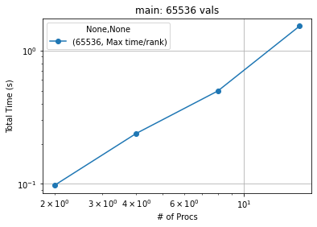
	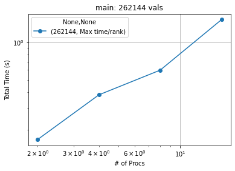
	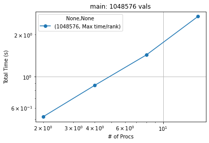
	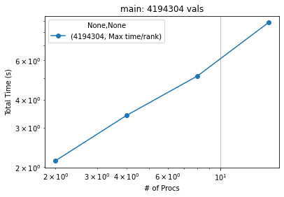
	
	
	
	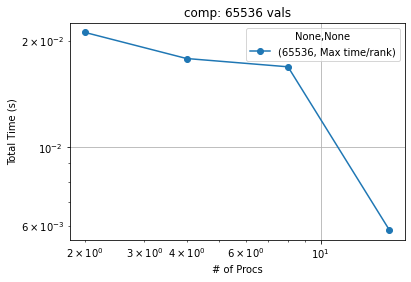
	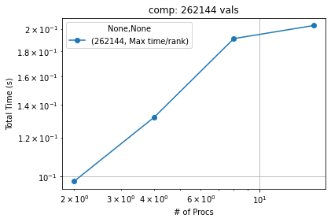
	
	
	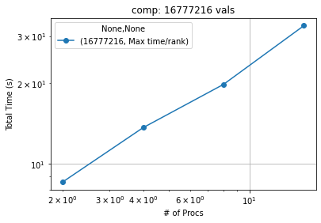
	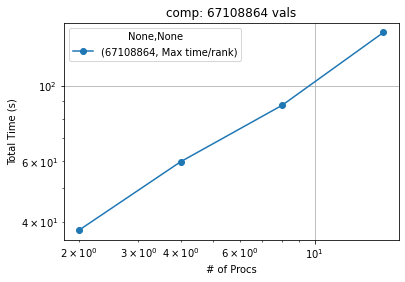
	
	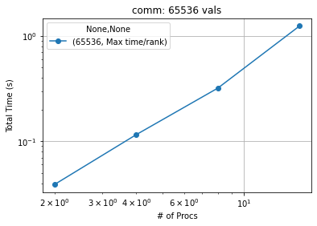
	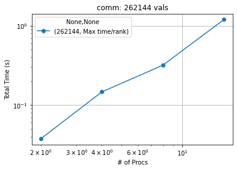
	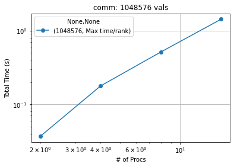
	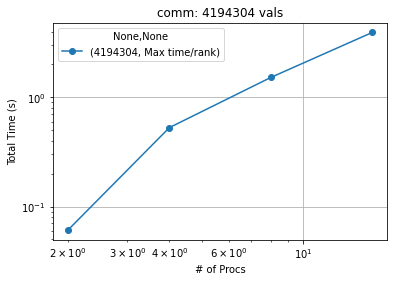
	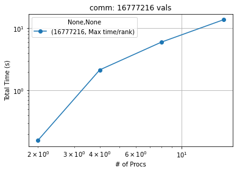
	
	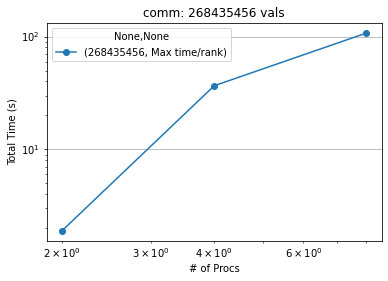
	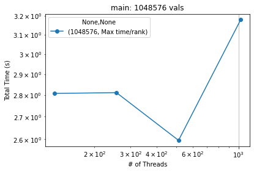

Bubble (CUDA):

  The Max time/rank for the CUDA implementation of the Bubble sort followed a similar pattern to the MPI implementation where increasing the threads/block roughly increases the execution time for the algorithm as a whole. This leads us to believe that the optimal amount of threads for the CUDA Bubble implementation is approximately 128 to 256 threads. 
  Like MPI, the communication time is expected to increase, and it did, but the computation time also increase which leads us to believe that Bubble Sort as a whole is not the best option for parallel computing.

  When we do parallelize it, it will perform much better than the serial counterpart but adding more and more parallelization will create an overhead that is not outweighed by the increase in speed.

  - Random Input:

	
	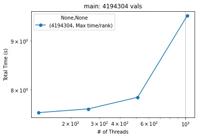
	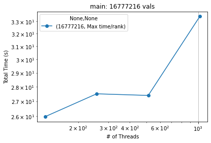
	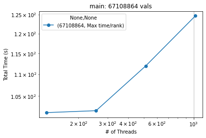
	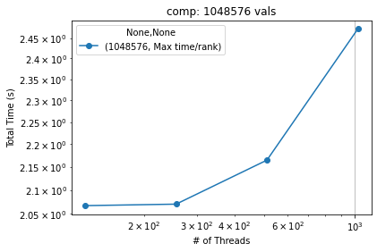
	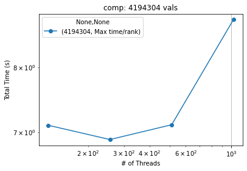
	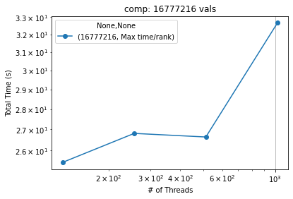
	
	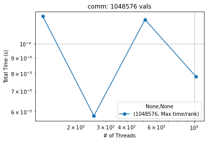
	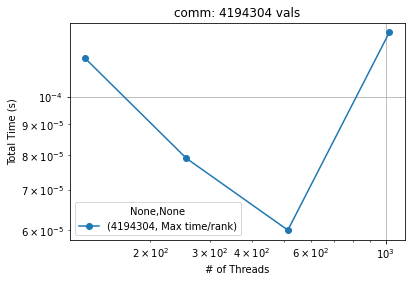
	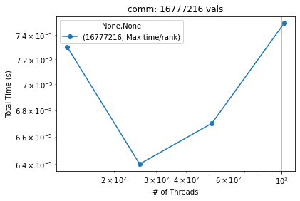
	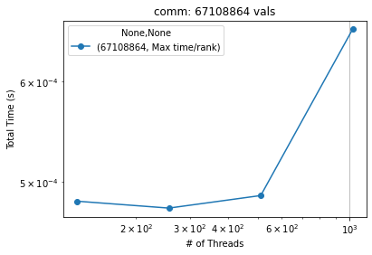

- Mergesort(MPI):
  
  The below graphs were generated using my mergesort MPI algorithm on a sorted list of integers. Initial analysis seems to indicate that my mergesort MPI implementation does not scale well in the slightest apart from a couple of interesting exceptions. For whatever reason, the average time per rank decreases signficantly for only a few types numbers of threads. This is inconsistent which could indicate an error on my part when generating the data, but it is known that mergesort is ineffecient for parallelism in general so the graphs could just be a consequence of that.  
  


- Mergesort Cuda

The Graphs below were generated by a GPU parallelization of mergesort. Initial analysis seems to indicate that the average computation time was steadily decreasing until reaching 1024 threads at which point there was a drastic dropoff


# 5. Presentation Graphs:
   
## Quicksort MPI
  

     
     
     
     
     
     
     
     


## Quicksort CUDA

     
     
     
     
     
     
     
     

## Odd-Even MPI
### Strong Scaling


     
     
     
     
     
     


     
     
     
     
     
     


     
     
     
     
     
     

### Weak Scaling

     
     
     


     
     
     


     
     
     

### Speedup

     
     
     
     
     
     


     
     
     
     
     
     


     
     
     
     
     
     

## Odd-Even CUDA
### Strong Scaling

     
     
     


     
     
     


     
     
     

### Weak Scaling

     
     
     


     
     
     


     
     
     

### Speedup

     
     


     
     


     
     

## MergeSort MPI
### Weak Scaling
**Sorted**


**Random**


**Reverse Sorted**


**1% Perturbed**


### Strong Scaling
**main**


**comp**


**comm**


### Speedup
**main**


**comp**


**comm**


## Mergesort CUDA
### Weak Scaling
**main**


**comp**


**comm**


### Strong Scaling
**main**


**comp**


**comm**


### Speedup
**main**

.png)

**comp**
**comm**


## Comparison of MPI Algorithms
### Speedup
**Random**


## Comparison of CUDA Algorithms
### Speedup
**Random**


     


     


     


  


